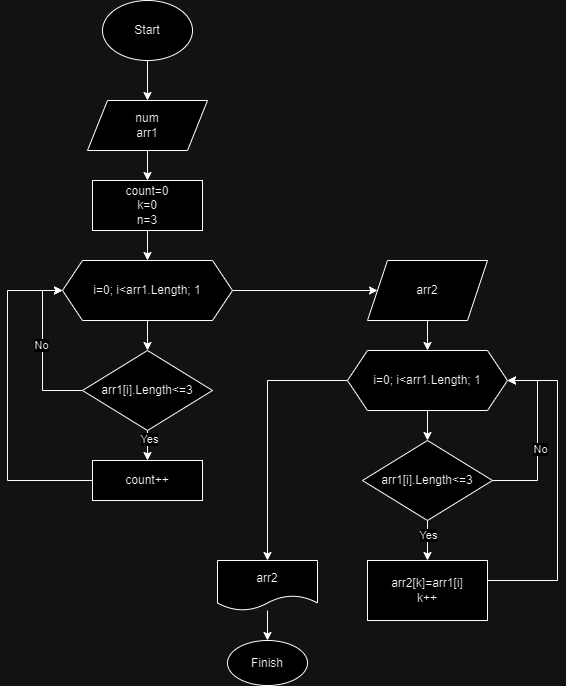

# Итоговая контрольная работа по основному блоку

## ***Условие задачи***

*Написать программу, которая из имеющегося массива строк формирует новый массив из строк, длина которых меньше, либо равна 3 символам. Первоначальный массив можно ввести с клавиатуры, либо задать на старте выполнения алгоритма. При решении не рекомендуется пользоваться коллекциями, лучше обойтись исключительно массивами.*

## ***Решение***

Данное решение задачи состоит из трех функций: ***PrintArray, CreateArray*** и ***SortArray.***

Функции:

- Функция ***PrintArray*** принимает массив строк array в качестве аргумента и выводит его содержимое на консоль в формате ***[элемент1, элемент2, ..., элементN]***. Она использует цикл ***for*** для перебора всех элементов массива и проверяет, является ли текущий элемент последним элементом массива, чтобы определить, нужно ли выводить запятую после элемента.

- Функция ***CreateArray*** запрашивает у пользователя количество слов, а затем последовательно запрашивает каждое слово и сохраняет его в массив ***array***. В конце она возвращает созданный массив.

- Функция ***SortArray*** принимает массив строк ***arr1*** в качестве аргумента и выполняет сортировку массива, оставляя только строки длиной меньше или равной ***3*** символам. Она сначала подсчитывает количество подходящих строк с помощью переменной ***count***, затем создает новый массив ***arr2*** с размером ***count*** и копирует в него подходящие строки из ***arr1***. В конце она возвращает отсортированный массив.

В основной части кода создается массив arr с помощью функции ***CreateArray***, затем этот массив сортируется с использованием функции ***SortArray*** и результат выводится на консоль с помощью функции ***PrintArray***. Таким образом, на экране будет выведен исходный массив ***arr***, а затем отфильтрованный массив ***sortArr***.

